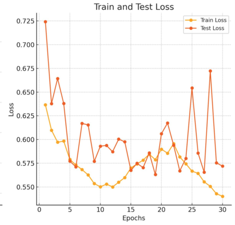
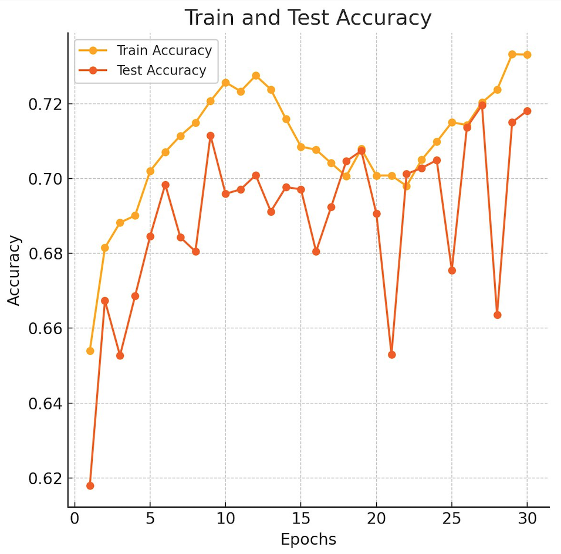

# Обнаружение переломов на медицинских снимках
## Структура проекта

- **src/**: Основной код проекта.
  - **train.py**: Содержит логику обучения модели.
  - **evaluate.py**: Проводит оценку модели, строит графики точности и потерь.
  - **utils.py**: Вспомогательные функции для загрузки данных, подсчета метрик и сохранения/загрузки модели.

- **models/**: Сохраненные модели с обученными весами.
  - **resnet50.pth**: Обученная модель.

- **requirements.txt**: Список зависимостей, необходимых для работы проекта.

- **README.md**: Описание проекта, инструкции по использованию.

## Описание

Модель обучается на датасете, содержащем 36 тысяч изображений по классам перелом/нет перелома с использованием предобученной архитектуры ResNet50. Обучение включает два этапа:

### Этап 1: Подбор гиперпараметров с использованием кросс-валидации

На первом этапе был выполнен подбор гиперпараметров, таких как размер батча, скорость обучения и тип планировщика. Для этого использовалась **кросс-валидация** для оценки разных комбинаций параметров и выбора оптимальных.

Подбор гиперпараметров был осуществлен с использованием **Optuna** (или альтернативных методов кросс-валидации). Процесс состоял из следующих шагов:

- **Кросс-валидация**: Данные были разбиты на 5 фолдов для кросс-валидации.
- **Гиперпараметры**:
  - Количество эпох: 30
  - Размер батча: 16, 32, 64
  - Темп обучения: 0.001, 0.0001, 0.00001
  - Оптимизатор: Adam

Для каждого набора гиперпараметров происходила кросс-валидация, после чего выбирались лучшие параметры.

### Этап 2: Основное обучение

После подбора гиперпараметров с помощью кросс-валидации, модель обучалась с выбранными оптимальными параметрами.

Основные параметры обучения:
- **Количество эпох:** 30
- **Размер батча:** 32
- **Тип оптимизатора:** Adam
- **Темп обучения:** 0.001
- **Планировщик:** CosineAnnealingLR

Процесс обучения включал несколько этапов:

1. **Подготовка данных:** Изображения были загружены и преобразованы в подходящий формат для модели.
2. **Аугментация данных:** Для повышения обобщающей способности модели применялись методы аугментации данных (например, случайные повороты и масштабирования).
3. **Обучение модели:** Модель ResNet50 была дообучена на обучающих данных. В качестве функции потерь использовалась кросс-энтропия, а в качестве метрики — точность.
4. **Валидация:** Во время обучения модель валидировалась на отдельном наборе данных для оценки её производительности.
5. **Тестирование:** После завершения обучения модель была протестирована на новых данных, чтобы оценить её эффективность на не виденных ранее примерах.

Во время обучения и валидации были построены следующие графики:

### График потерь



### График точности



## Использование

1. Клонируйте репозиторий:
   ```bash
   git clone https://github.com/your-username/your-repository.git
   cd your-repository
2. Установите зависимости:
   ```bash
   pip install -r requirements.txt
3. Используйте модель для работы на новых данных:
   ```bash
   python src/test.py
